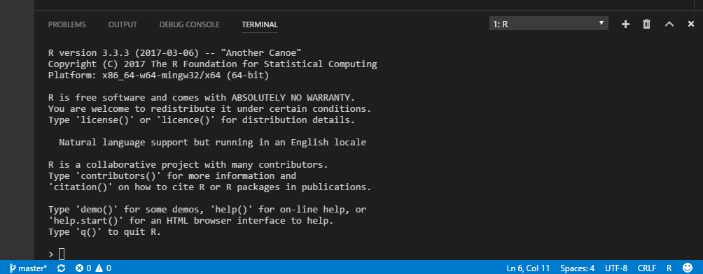
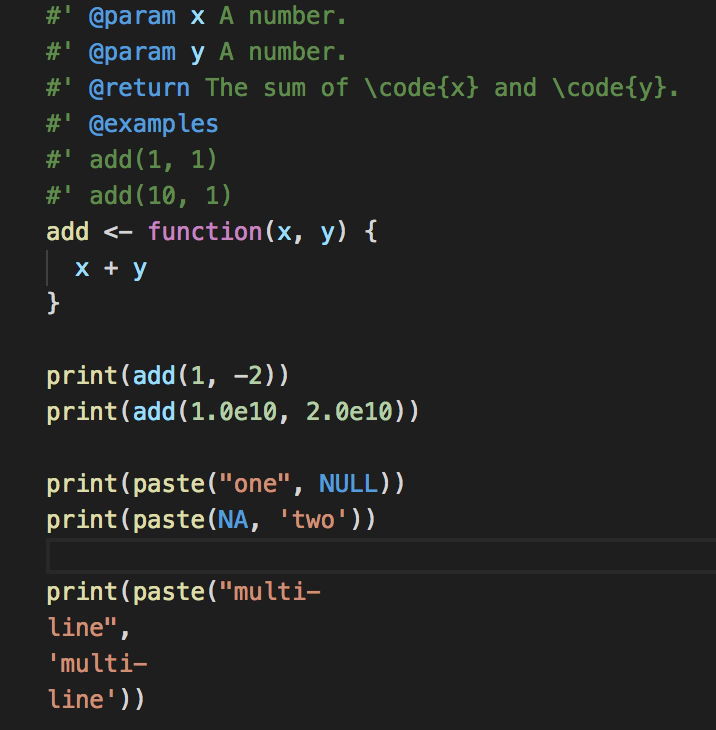
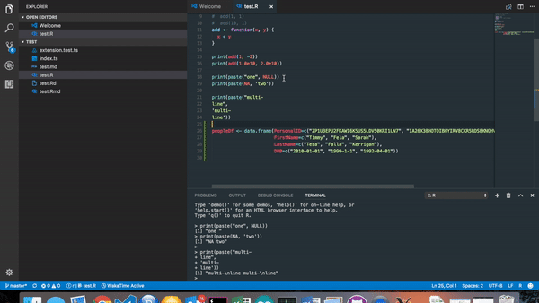

# R support for Visual Studio Code

Requires [R](https://www.r-project.org/).

## Usage

* For Windows, set config `r.rterm.windows` to your `R.exe` Path like `"C:\\Program Files\\R\\R-3.3.4\\bin\\x64\\R.exe"`;
* For Radian console, enable config `r.bracketedPaste`
* Open your *folder* that has R source file (**Can't work if you open only file**)
* Use `F1` key and `R:` command or `Ctrl+Enter`(Mac: `⌘+Enter`)

## Features

* Run Source(`Ctrl+Shift+S` or Push icon) and Run Selected Line (`Ctrl+Enter`)
* Run `nrow`, `length`, `head`, `thead`, `names` functions (`Ctrl` + `1`, `2`, `3`, `4`, `5`)
  * If you are using Mac `Ctrl` to `⌘`


* R Integrated Terminal



* Run code in terminal containing existing R session, for example over SSH (`Run Selection/Line in Active Terminal`)
* Run all commands in terminal containing existing R session (enable config `r.alwaysUseActiveTerminal`)


* Extended Syntax(R, R Markdown, R Documentation)



* Create .gitignore based [R.gitignore](https://github.com/github/gitignore/raw/master/R.gitignore)

* Data frame viewer and Environment viewer(`Preview Data frame` or `Preview Environment`)



* Snippets

* Package development short cut (`Load All`, `Test Package`, `Install Package`, `Build Package` and `Document`)

## Requirements

* R base from <https://www.r-project.org/>

## Extension Settings

This extension contributes the following settings:

* `r.rterm.windows`: set to R.exe path for Windows
* `r.rterm.mac`: set to R term's path for Mac OS X
* `r.rterm.linux`: set to R term's path for Linux
* `r.rpath.lsp`: set to R.exe path for Language Server Protocol
* `r.rterm.option`: R command line options (i.e: --vanilla)
* `r.source.encoding`: An optional encoding to pass to R when executing the file
* `r.source.focus`: Keeping focus when running (editor or terminal)
* `r.alwaysUseActiveTerminal`: Use active terminal for all commands, rather than creating a new R terminal
* `r.bracketedPaste`: For consoles supporting bracketed paste mode (such as Radian)
* `r.sessionWatcher`: Enable R session watcher (experimental)

* Language server(developing [here](https://github.com/REditorSupport/languageserver))

## R Session Watcher (Experimental)

*This experimental feature is still under development and the behavior
**may change without notice**. Please file an issue [here](https://github.com/Ikuyadeu/vscode-R/issues) if you experience problems or have any suggestions.*

An opt-in experimental R session watcher is implemented to support the following features:

* Watch any R session
* Show value of session symbol on hover
* Provide completion for session symbol
* `View()` any objects including data frames and list objects
* Show plot output on update
* Show htmlwidgets, documentation and shiny apps in WebView

### Basic usage

To enable this feature, turn on `r.sessionWatcher` in VSCode settings, reload or restart VSCode, and the session watcher will be activated automatically
on R sessions launched by vscode-R via `R: Create R Terminal` command.

### Advanced usage (for self-managed R sessions)

For advanced users to work with self-managed R sessions (e.g. manually started R terminal in `tmux` or `screen` window), some extra
configuration is needed. Follow the steps below to make R session watcher work with any external R session:

1. Turn on `r.sessionWatcher` in VSCode settings.
2. Edit `.Rprofile` in your home directory by running the following code in R:

    ```r
    file.edit("~/.Rprofile")
    ```

3. Append the following code to the file:

    ```r
    source(file.path(Sys.getenv(if (.Platform$OS.type == "windows") "USERPROFILE" else "HOME"), ".vscode-R", "init.R"))
    ```

4. Restart or Reload Window in VSCode

If the workspace folder you open in VSCode already has a `.Rprofile`, you need to append the code above in this file too because `~/.Rprofile` will not
be executed when a local `.Rprofile` is found.

The script only works with environment variable `TERM_PROGRAM=vscode`. the script will not take effect with R sessions started in a `tmux` or `screen` window that does not have it, unless this environment variable is manually set before sourcing `init.R`, for example, you may insert a line `Sys.setenv(TERM_PROGRAM="vscode")` before it.

### How to disable it

For the case of basic usage, turning off `r.sessionWatcher` in VSCode settings is sufficient
to disable R session watcher.

For the case of advanced usage, user should, in addition, comment out or remove the `source(...)` line appended to `~/.Rprofile`.

### How it works

This script writes the metadata of symbols in the global environment and plot file to `${workspaceFolder}/.vscode/vscode-R/PID` where `PID` is the R process ID. It also captures user input and append command lines to `${workspaceFolder}/.vscode/vscode-R/response.log`, which enables the communication between vscode-R and a live R sesson.

Each time the extension is activated, the latest session watcher script (`init.R`) will be deployed to `~/.vscode-R/init.R`.

R sessions started from the workspace root folder will be automatically attached. The session watcher is designed to work in a wide range of scenarios:

* Official R terminal or `radian` console
* R session started by vscode-R or user
* R session in a `tmux` or `screen` window
* Switch between multiple running R sessions
* [Remote Development](https://code.visualstudio.com/docs/remote/remote-overview) via SSH, WSL and Docker

The status bar item shows the process id of the attached R session. Click the status bar item and it will
attach to currently active session.


*The R terminal used in the screenshot is [radian](https://github.com/randy3k/radian) which is cross-platform and
supports syntax highlighting, auto-completion and many other features.*

## TODO

* Debug

## CONTRIBUTING

* Please see [CONTRIBUTING.md](https://github.com/Ikuyadeu/vscode-R/blob/master/CONTRIBUTING.md)

This extension based on

* [r.tmbundle](https://github.com/textmate/r.tmbundle)
* [markdown-redcarpet.tmbundle](https://github.com/streeter/markdown-redcarpet.tmbundle)
* [Markdown extension in VS Code](https://github.com/Microsoft/vscode/blob/master/extensions/markdown/snippets/markdown.json)
* [R.gitignore](https://github.com/github/gitignore/raw/master/R.gitignore)
* [language-r](https://github.com/lee-dohm/language-r)
* [R box](https://github.com/randy3k/R-Box)

## Collaborators

I hope you will join us.

* [@andycraig](https://github.com/andycraig)
* [@Ladvien](https://github.com/Ladvien)

## FAQ

* Q: I can't use command and message is `xxx no command found`.
* A: Please open your folder that has R source file

The R logo is © 2016 The R Foundation
