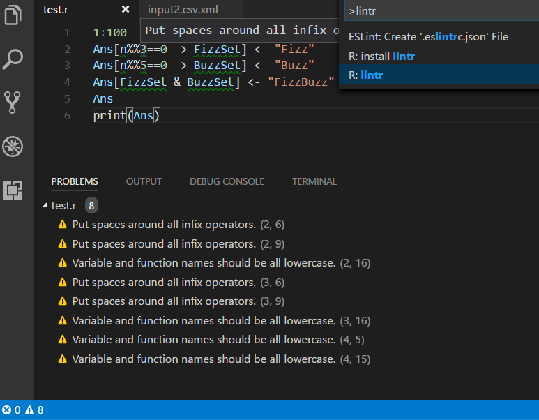

# R
R language support for VS Code.
Requires [R](https://www.r-project.org/).

# Usage
* For Windows, set config `r.rterm.windows` to your `R.exe` Path like `"C:\\Program Files\\R\\R-3.3.4\\bin\\x64\\R.exe"`;
* Open your folder that has R source file (**Can't work if you open only file**)
* Use `F1` key and `R:` command or `alt+enter`

## Features
* Run Source and Run Selected

* R Integrated Terminal

* Extended Syntax(R, R Markdown, R Documentation)

* Support [lintr](https://github.com/jimhester/lintr)

* Create .gitignore based [R.gitignore](https://github.com/github/gitignore/raw/master/R.gitignore)
* Data frame viewer
* Snippets

## Requirements
* R base from https://www.r-project.org/
* lintr package

## Extension Settings
This extension contributes the following settings:

* `r.rterm.windows`: set to R.exe path for Windows
* `r.rterm.mac`: set to R term's path for Mac OS X
* `r.rterm.linux`: set to R term's path for Linux
* `r.rterm.option`: R command line options (i.e: --vanilla)
* `r.source.encoding`: An optional encoding to pass to R when executing the file
* `r.lintr.linters`: list of [linter functions](https://github.com/jimhester/lintr#available-linters)
* `r.lintr.cache`: toggle caching of lint results
* `r.lintr.executable`: R executable path for lintr(if not set, used r.rterm.xxx)
* `r.source.focus` : Keeping focus when running(editor or terminal)
 
## TODO
* Intellisense
* Output Plot
* Debug
* Language Server

This extension based on 
* [r.tmbundle](https://github.com/textmate/r.tmbundle)
* [markdown-redcarpet.tmbundle](https://github.com/streeter/markdown-redcarpet.tmbundle)
* [Markdown extension in VS Code](https://github.com/Microsoft/vscode/blob/master/extensions/markdown/snippets/markdown.json)
* [R.gitignore](https://github.com/github/gitignore/raw/master/R.gitignore)
* [language-r](https://github.com/lee-dohm/language-r)
* [R box](https://github.com/randy3k/R-Box)

## FAQ
* Q: I can't use command and message is `xxx no command found`.
* A: Please open your folder that has R source file

The R logo is © 2016 The R Foundation
